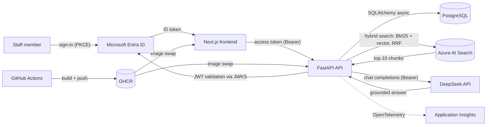

# Office Asset & Request Tracker

An internal tool for a small organisation: track equipment, run loan and return requests through an approval workflow, and answer staff questions about IT policy from the organisation's own help docs.


## The problem

In a small office, equipment lives in spreadsheets and people's heads. There is no shared source of truth, so laptops get double-booked, damage goes unreported, approvals happen by email and disappear, and nobody can tell you what happens to the projector when you leave. This project is that source of truth, and it works for a small ICT team with no dedicated inventory staff:

- **Inventory with real concurrency guarantees** — two staff members cannot be loaned the same item on overlapping dates; the database enforces it, not just the app (docs/adr/0002).
- **An approval workflow that leaves a trail** — request → manager → ICT, every decision audited append-only.
- **A staff assistant that is not a black box** — staff ask "how long can I borrow a laptop?" in plain words, and the answer is generated from the office's own policy articles, with the exact source chunks shown, scored and linked (docs/adr/0004, docs/adr/0005).

## Try it live

**https://asset-tracker-frontend.bravedune-a10019ed.canadacentral.azurecontainerapps.io**

Sign-in is Microsoft Entra ID, restricted to the demo tenant's invited accounts.

## Architecture



- **Frontend** — Next.js App Router, MSAL React. The SPA is deliberately trusted-until-proven: the API validates every token itself, so the app holds no secrets (the `NEXT_PUBLIC_*` values are public by design).
- **API** — FastAPI, stateless, async SQLAlchemy. Every protected route validates the JWT against Entra ID's JWKS server-side; app roles gate approvals and audit.
- **Database** — PostgreSQL: loans are protected by an exclusion constraint (two loans on the same asset can never overlap, even under racing requests), approvals commit as one transaction, the audit log is append-only.
- **Assistant** — six help articles are chunked (~400 tokens, sentence-complete), embedded locally (fastembed, 384-dim), and indexed in Azure AI Search. Queries run hybrid (BM25 + vector, merged with RRF) and the top chunks go to a hosted LLM (DeepSeek `deepseek-chat`, OpenAI-compatible wire format — the provider is a base URL away). No key, no generation: the endpoint degrades to citations-only instead of failing. Scores below a hard floor refuse deterministically; above it, the model itself is instructed to refuse semantic mismatches (docs/adr/0004).
- **Deploy** — every merge to `main` builds both images in GitHub Actions and swaps them into Azure Container Apps (docs/adr/0003 — App Service is quota-blocked on free trials); telemetry flows to Application Insights, env-gated so local runs are quiet.

## Features

| Screen | What it does |
| --- | --- |
| Asset catalog | Inventory with status, condition, and per-item pages |
| Raise request | Loan requests with justification; approvers decide with full history |
| Approvals | Manager/ICT queues; approving commits four writes atomically |
| My loans | Active loans with due dates and renewal |
| Audit log | Append-only trail of every state change |
| Ask ICT | Policy Q&A with cited sources — answer, refusal, or citations-only, and always the evidence |

## Screenshots

_To add: captured from the live site (login-gated, so they are taken by hand) — asset catalog, a request through approval, and an Ask ICT answer with its cited sources. Roughly 1200px wide, PNG, under `docs/screenshots/`, referenced here._

## Testing approach

The suite is hermetic: **105 tests** run in CI against a real Postgres 16 (service container) with every external provider faked at our boundary — JWT validation against locally minted tokens and a mocked JWKS, the search client and the LLM HTTP call replaced by fakes that pin the wire contract (a provider mismatch fails the test, not a live 500). The race-condition and transaction-boundary tests are the ones the plan refused to skip: they prove the database constraints, not just the happy path.

CI gates: `ruff check`, `ruff format --check`, `pytest` (with migrations applied), plus a production `next build`.

Probabilistic quality (retrieval relevance, generated answers) cannot be unit-tested — see docs/adr/0005. It is covered by a ten-pair **golden set** (`docs/golden-set.md`, `scripts/golden_set.py`) run by hand against the live services; the last run retrieved the expected article for 7/7 answerable questions.

## What changes at scale

The choices are sized for a 30-person office and a 50 MB search index, and each has a documented upgrade path:

- **AI Search Free tier** (1 service, 50 MB, no semantic ranker) → Basic when the corpus outgrows it: semantic ranker, bigger indexes, more queries/sec. Hybrid + top-k is already beyond what the current corpus needs.
- **Local embeddings** (fastembed, baked into the image) → a hosted embedding API once the corpus is large enough that per-chunk compute matters; the vector field and retrieval contract stay the same.
- **Direct-to-provider generation** → a gateway (retries, budgets, logging) or Azure OpenAI behind the same OpenAI-compatible wire format — a base URL and model name away.
- **Single Postgres** → connection pooling (PgBouncer) first, then read replicas; the async driver already keeps connections small.
- **One-shot ingest CLI** → a scheduled ingestion pipeline when docs change more than weekly; the index is defined in code and upserts are idempotent.
- **App roles for authz** → Entra ID groups when the org grows past one approver; the role check lives in one dependency.

## Local development

```sh
docker compose up -d          # Postgres 16
cp .env.example .env          # config comes from the environment
uv sync                       # install locked deps
uv run pytest                 # run the test suite
uv run alembic upgrade head   # apply migrations
uv run python -m scripts.seed # demo assets
uv run uvicorn app.main:app --reload   # API on :8000

cd frontend
npm install
npm run dev                   # SPA on :3000 (see .env for API base)
```

The assistant needs Azure AI Search (`AI_SEARCH_ENDPOINT`/`AI_SEARCH_KEY`) and, for answers, an LLM key — without them `/assistant/query` degrades cleanly. Ingest the help docs with `uv run python -m app.assistant.ingest`.

## Documentation

- `docs/adr/` — architectural decisions (stack, concurrency, hosting, RAG, evaluation)
- `docs/plan.md` — the seven-day build schedule and its rationale
- `docs/learning-log.md` — what was built, what broke, and the fix, per session
- `docs/golden-set.md` — the assistant's manual evaluation set
